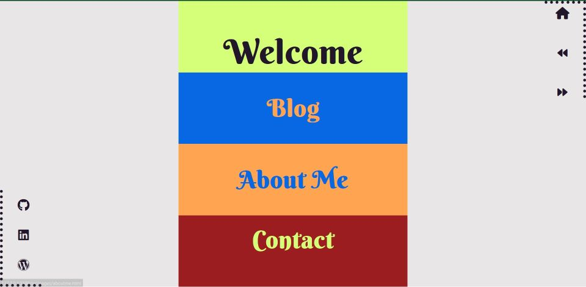
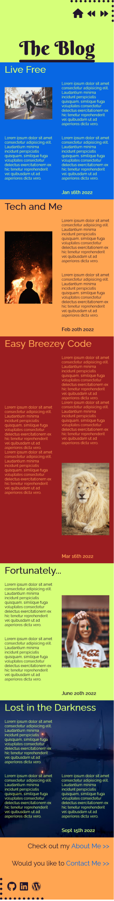
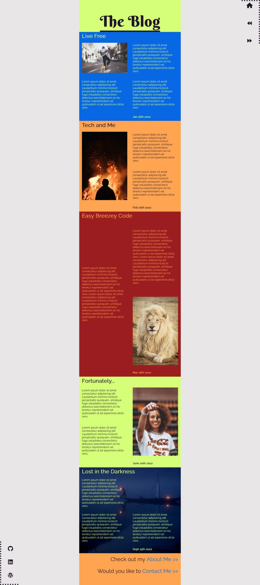
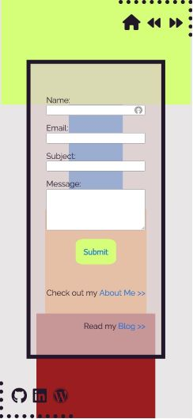
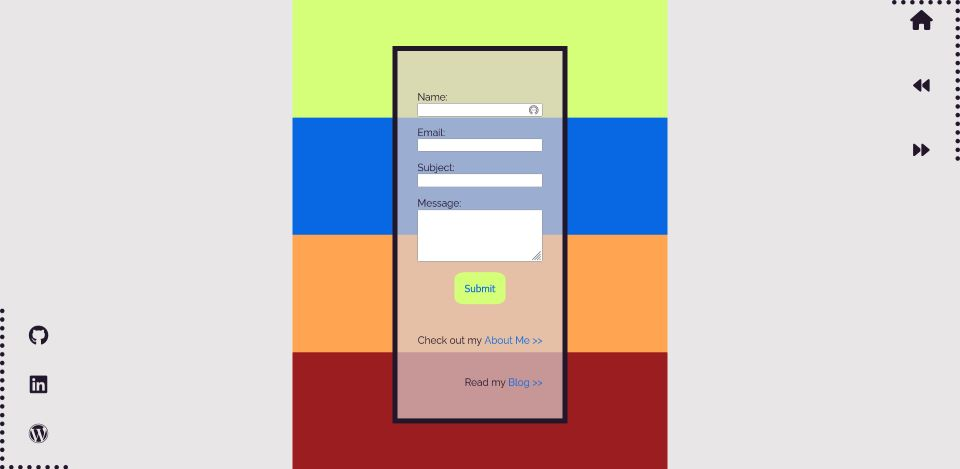
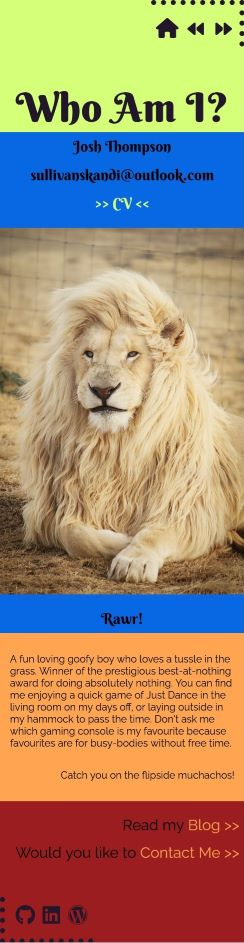
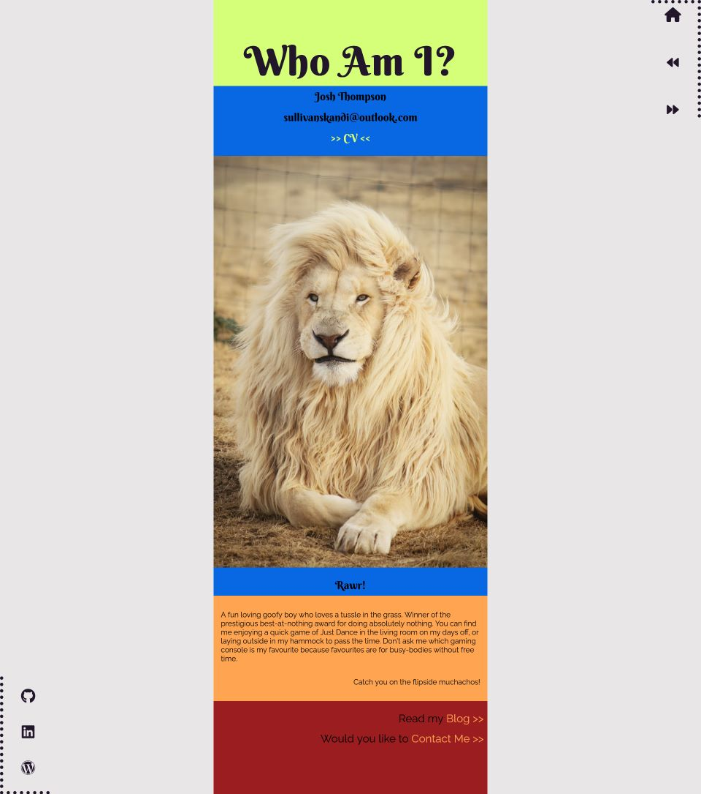

# Github
https://github.com/O-App-Pesi/fluffy-couscous
# Purpose
The purpose of this website is to introduce me as a developer.
# Functionality/Features
The website contains 4 HTML documents, each styled using SCSS. Each page has a header and footer with the homepage directing to the external pages which have different information about me. The Header contains a home button, taking you back to the homepage, as well as a backwards and forwards button. The Footer has external links to my LinkedIn, Github and Wordpress. Each heading on the welcome page links to its named page. The Blog page has a list of Blog entries as well as links on the button directing to the other two pages. The Contact page contains a form and links just like the Blog page. The About Me page has a link to a PDF of my CV as well as information about myself, with links at the bottom as well.
# Sitemap

# Screenshots
## Homepage

## Blog

## Contact

## About Me

# Target Audience
My target audience is employers looking to engage an IT Professional :joy:
# Tech Stack
1. HTML
2. CSS
3. SCSS
4. Javascript
5. Hosted on Github
6. Deployed using Netlify